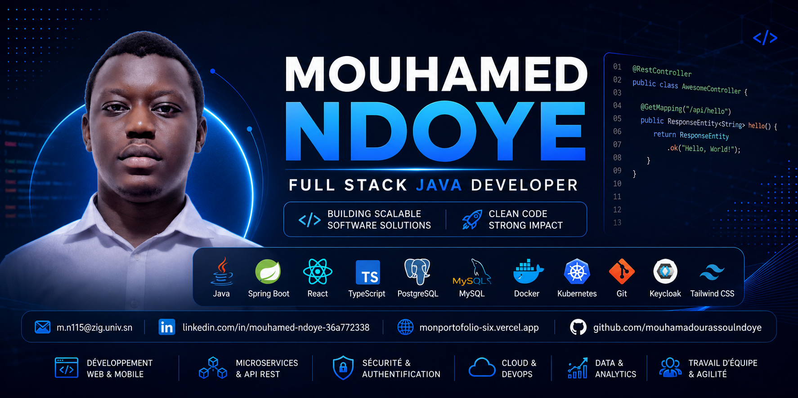

<!-- ========================================================= -->
<!--                 MOUHAMED NDOYE GITHUB PROFILE              -->
<!-- ========================================================= -->

  

# 👋 Bonjour, je suis Mouhamed Ndoye

### Full Stack Java Developer • Spring Boot • React • Software Engineering

 

---

# 👨‍💻 About Me

🎓 Master's student in **Software Engineering**

💻 Full Stack Java Developer

🚀 Passionate about

- Java
- Spring Boot
- React
- Software Architecture
- Microservices
- Cloud Computing
- DevOps

---

# 🚀 Current Focus

- 🔹 Spring Boot
- 🔹 React
- 🔹 REST API
- 🔹 Docker
- 🔹 Kubernetes
- 🔹 Software Architecture

---

# 🛠 Tech Stack

### Languages

---

### Backend

Spring Boot • Spring Security • REST API • Hibernate • JPA • Keycloak

---

### Frontend

---

### Databases

Oracle Database • Cassandra

---

### DevOps

